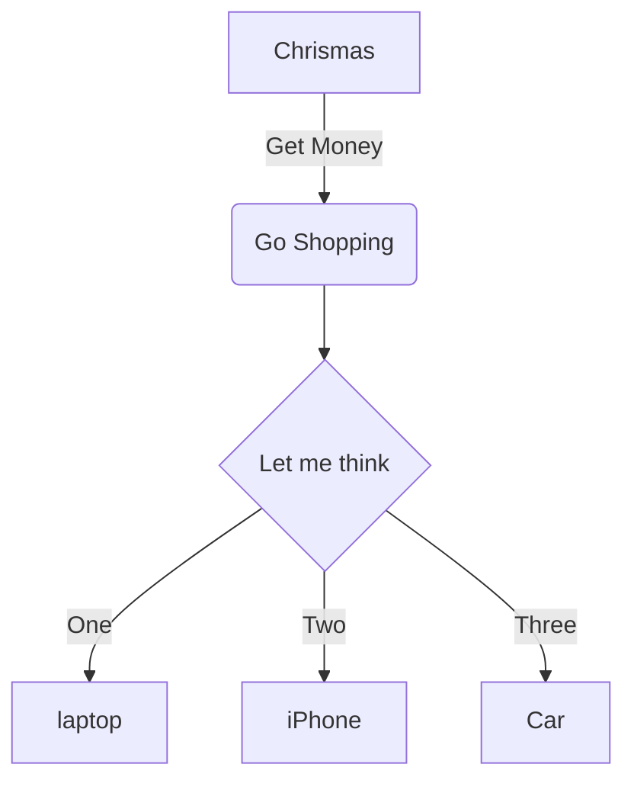
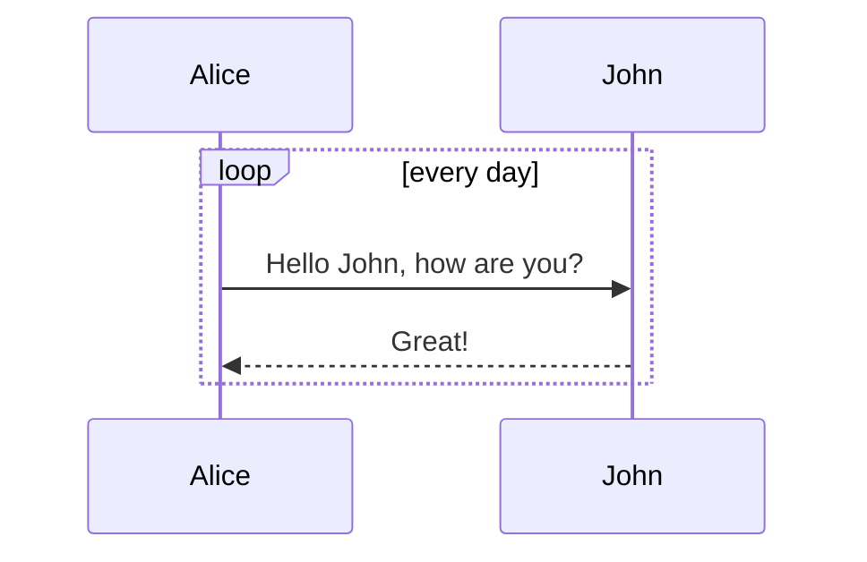
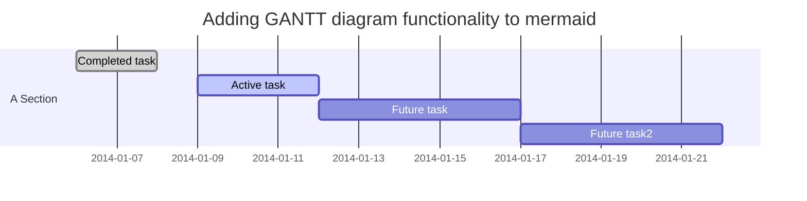

## 0 简介
在很多时候我们习惯于使用 Markdown 进行书写，但书写完成后需要进行格式化和排版才能在公众号文章里进行很好的呈现。可以达成的方式有很多，但这儿只讲述个人最常用的方式，主要包含如下步骤：

1) 使用 Typora / VSCode 进行 Markdown 文档的书写
2) 在 [Md2All](http://md.aclickall.com/) 完成排版并粘贴到公众号的后台进行再编辑
3) 发布

可见整个过程非常简洁方便，在随后的部分中将分别对不同的元素做简要描述。

## 1 注脚
更多语法请参考[^01]，点击可跳转。

## 2 引用块
> 微信公众号搜索：**大巴山樵夫**
关注可了解工作日常等常用技术分享。

## 3 代码块
```python
print("Hello, world!")
```

## 4 待办事项
- [ ] a bigger project
    - [x] first subtask
    - [x] follow up subtask
    - [ ] final subtask
- [ ] a separate task

[Task List Syntax](https：//help.github.com/articles/writing-on-github/#task-lists)

## 5 图像


## 6 表格

| First Header   | Second Header  |
| -------------: | :------------- |
| cell 1         | cell 2         |
| first column   | second column <br> One more thing |

## 7 公式
行内公式： $e^{x^2}\neq{e^x}^2$

块间公式：

$$
H(D_2) = -(\frac{2}{4}\ log_2 \frac{2}{4} + \frac{2}{4}\ log_2 \frac{2}{4}) = 1
$$

以及矩阵：

$$
        \begin{pmatrix}
        1 & a_1 & a_1^2 & \cdots & a_1^n \\
        1 & a_2 & a_2^2 & \cdots & a_2^n \\
        \vdots & \vdots & \vdots & \ddots & \vdots \\
        1 & a_m & a_m^2 & \cdots & a_m^n \\
        \end{pmatrix}
$$

***
如下部分当前仅在 Typora/github 中得到支持。

## - 流程图 Flowchart


## - 序列图 Sequence diagram


## - 甘特图 Gantt diagram


***
参考
[^01]: [Md2All](http://md.aclickall.com/)
