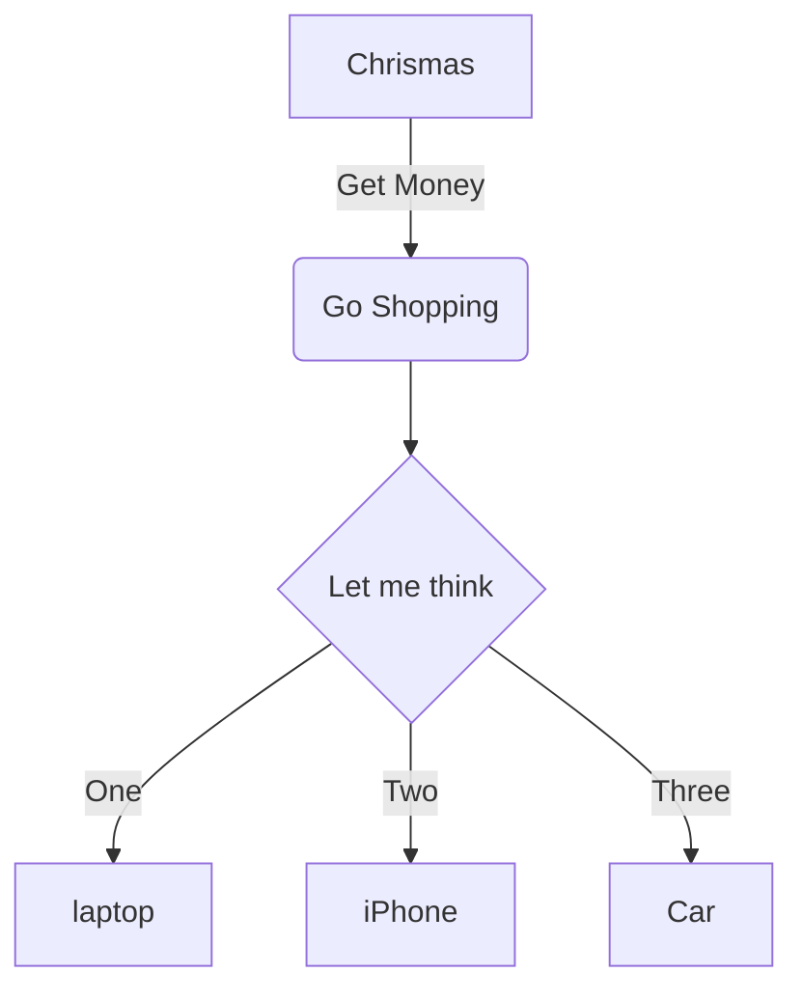
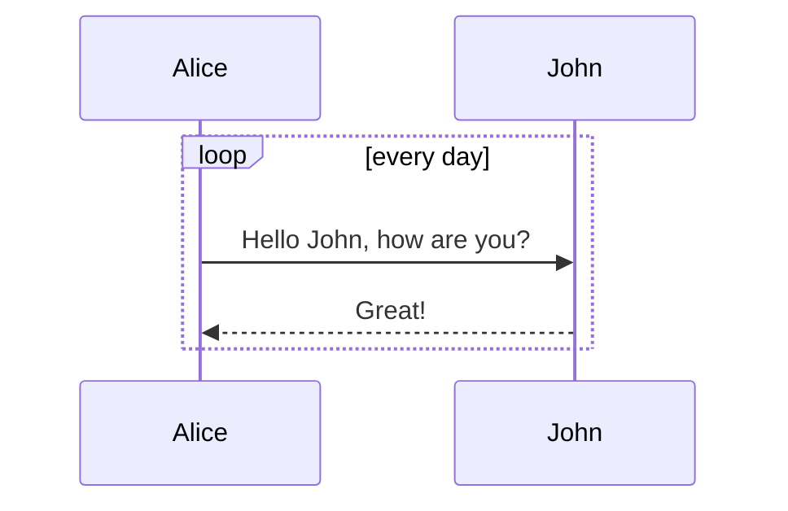
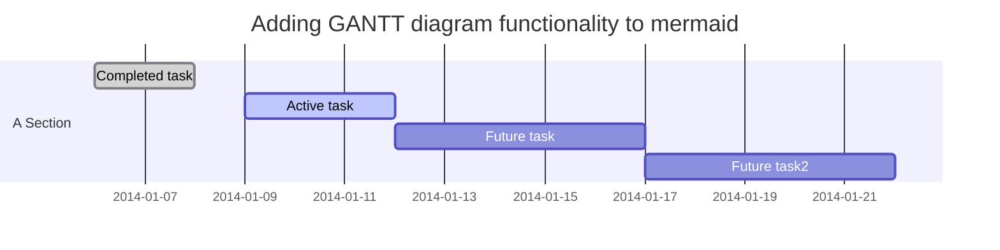

# 常用 Markdown 语法
## 1 代码高亮

### `print 'Hello code' `

```python
print("Hello, world!")
```

## 2 制作待办事项

### Task List

- [ ] a bigger project
    - [x] first subtask
    - [x] follow up subtask
    - [ ] final subtask
- [ ] a separate task

[Task List Syntax](https：//help.github.com/articles/writing-on-github/#task-lists)

## 3 高效绘制流程图、序列图、甘特图、表格、公式

### 3.1 流程图 Flowchart


### 3.2 序列图 Sequence diagram


### 3.3 甘特图 Gantt diagram


### 3.4 表格 Tables and alignment

| First Header                | Second Header                |
| --------------------------- | ---------------------------- |
| Content from cell 1         | Content from cell 2          |
| Content in the first columu | Content in the second columu |

| Left-Aligned | Center Aligned  | Right Aligned |
| ------------ | --------------- | ------------- |
| col 3 is     | some wordy text | $1600         |
| col 2 is     | centered        | $12           |

### 3.5 公式 LaTeX Mathmatical Formula

Math inline: $\dfrac{\tfrac{1}{2}[1-(\tfrac{1}{2})^n]}{1-\tfrac{1}{2}} = s_n$

Math block:
$$
\oint_C x^3\,dx + 4y^2\,dy
$$

$$
2 = \left(\frac{\left(3-x\right)\times2}{3-x}\right)
$$

$$
\sum_{m=1}^\infty\sum_{n=1}^\infty\frac{m^2\,n}{3^m\left(m\,3^n+n\,3^m\right)}
$$

$$
\phi_n(\kappa) = \frac{1}{\kappa\pi^2}\int_0^\infty\frac{\sin(\kappa R)}{\kappa R}R^2
$$

